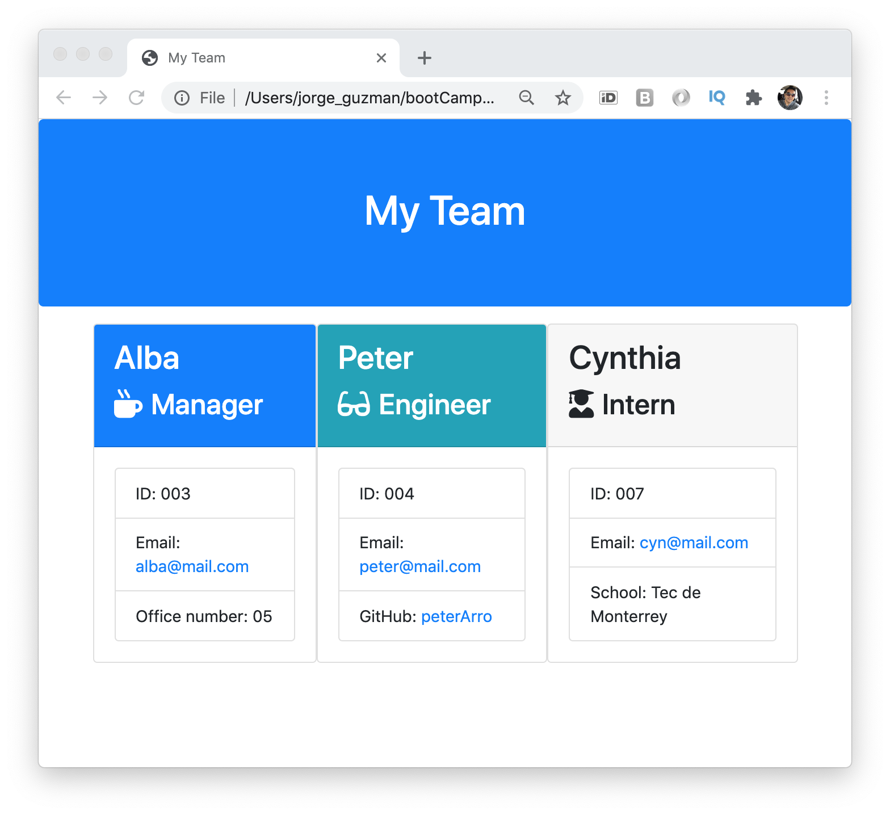

# Team Profile Generator

A Node CLI that takes in information about employees and generates an HTML webpage that displays summaries for each person.

## Badges

Code quality and validation

Repository Status

License

## Table of contents

- [Team Profile Generator](#team-profile-generator)
  - [Badges](#badges)
  - [Table of contents](#table-of-contents)
  - [The challenge](#the-challenge)
  - [The development process](#the-development-process)
  - [The Output](#the-output)
  - [Installation and Usage](#installation-and-usage)
  - [Credits, tools and other references](#credits-tools-and-other-references)
  - [Contributing](#contributing)
  - [Questions](#questions)

## The challenge

To build a software engineering team generator command line application. The application will prompt the user for information about the team manager and then information about the team members. The user can input any number of team members, and they may be a mix of engineers and interns. When the user has completed building the team, the application will create an HTML file that displays a nicely formatted team roster based on the information provided by the user.

Main elements:

- [x] CLI application to promt user with team member's information
- [x] Creation of output/team.html with team member's information
- [x] The application must also pass all unit tests

## The development process

In order to accomplish the challenge, the following steps were done:

1. Understand the purpose, and concept of the application.
2. Understand the provided code.
3. Define and code the classes.
4. Run the tests and apply required adjustments.
5. Create functionality.
6. Final review and proper documentation.
7. Create video to explain use of the application.

## The Output

With the described process we were able to create a useful command line interface (CLI) application that promts user information from the CLI and creates an HTML file with team's profiles.

**User story**

As a manager, I want to generate a webpage that displays my team's basic info, so that I have quick access to emails and GitHub profiles.

**The application**

## Installation and Usage

The project was uploaded to [GitHub](https://github.com/) at the following repository:
[https://github.com/jorguzman100/10_Team_Profile_Generator](https://github.com/jorguzman100/10_Team_Profile_Generator)

You can access the deployed application with the GitHup Pages link:
[https://jorguzman100.github.io/10_Team_Profile_Generator/](https://jorguzman100.github.io/10_Team_Profile_Generator/)

To install the project follow these steps:

1. Download the application from repository.
2. In the root folder, install components with: npm install
3. Run the CLI application from the terminal with: node app.js

## Credits, tools and other references

**Third Party Assets**

[Bootstrap](https://getbootstrap.com/)

[Font Awesome](https://fontawesome.com/)

[Markup Validation Service](https://validator.w3.org/)

## Contributing

- Pull requests are welcome.
- For major changes, please open an issue first to discuss what you would like to change.
- Please make sure to update tests as appropriate.

## Questions

If you have questions or you want to share comments, we will be glad to hear from you. Please contact us at [jorguzman100@gmail.com](jorguzman100@gmail.com).
